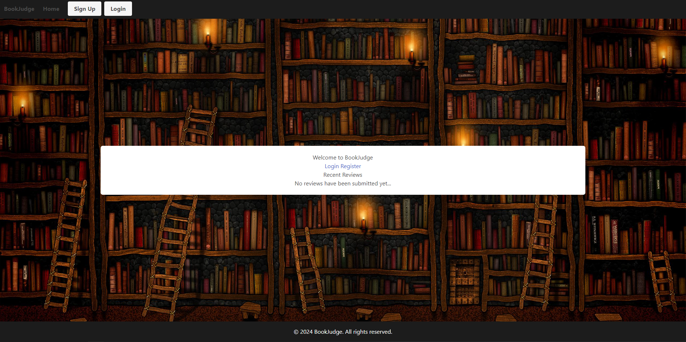
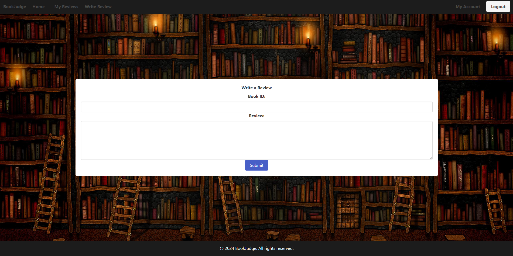
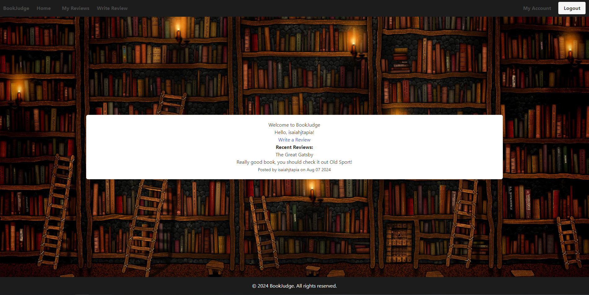

# BookJudge

## Project Overview

BookJudge is an application that allows users to create a public book review based on books they have read which is visible to any individual on the application.

## Project Requirements

Our project fulfills the following requirements:

- Use Node.js and Express.js to create a RESTful API.
- Use Handlebars.js as the template engine.
- Use PostgreSQL and the Sequelize ORM for the database.
- Have both GET and POST routes for retrieving and adding new data.
- Use at least one new library, package, or technology that we haven’t discussed.
- Have a folder structure that meets the MVC paradigm.
- Include authentication (express-session and cookies).
- Protect API keys and sensitive information with environment variables.
- Be deployed using Render (with data).
- Have a polished UI.
- Be responsive.
- Be interactive (i.e., accept and respond to user input).
- Meet good-quality coding standards (file structure, naming conventions, follows best practices for class/id naming conventions, indentation, quality comments, etc.).
- Have a professional README (with unique name, description, technologies used, screenshot, and link to deployed application).

## Technologies Used

- Node.js 
- Express.js
- PostgreSQL
- Sequelize
- Handlebars.js
- DBeaver

## Links

- [Deployed Application](https://lockaa.github.io/marvel-mantras/)
- [GitHub Repository](https://github.com/isaiahtapia/BookJudge)

## Installation

To begin the installing of this application, you will need to install packages:

[bcrypt]
[Handlebars]
[Nodemon]
[Express]
[Sequelize]
[Pg]

## Usage

The live site may be viewed at the following URL:

- [Deployed Application](https://lockaa.github.io/marvel-mantras/)

  
Screenshot of the webapp

    

  

## License

This project is licensed under the MIT License. For more information read the LICENSE file.

---